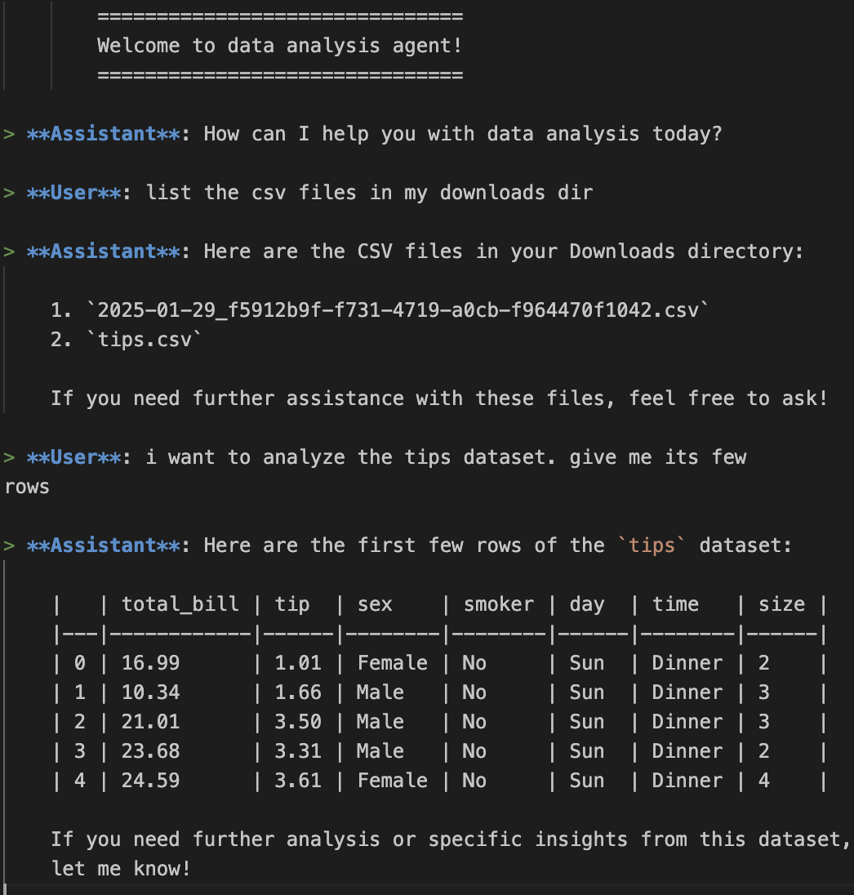
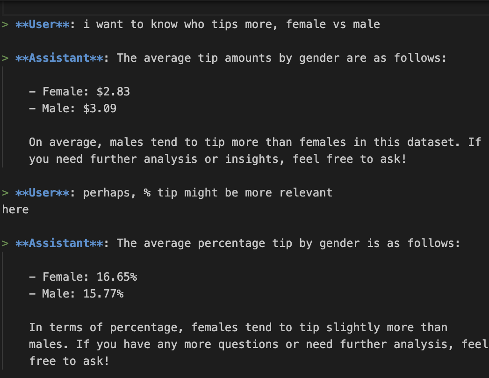
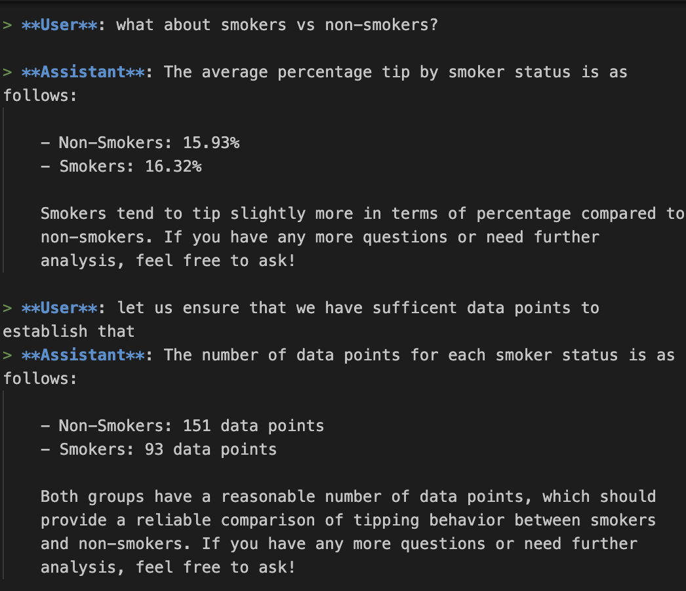

# EDA Agent
Data Science Agent for exploratory data analysis

Steps to run:
1. Set OpenAPI key in the `OPENAI_API_KEY` environment variable.
2. Run the command `python eda_agent.py`

# Dependencies
`pip install openai os pandas json`

# Example Session

